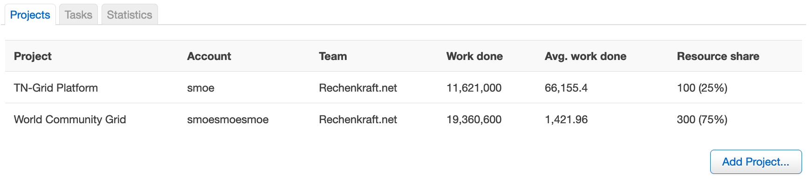
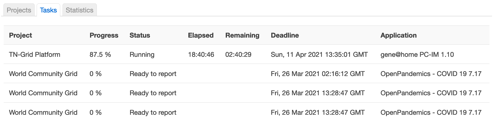
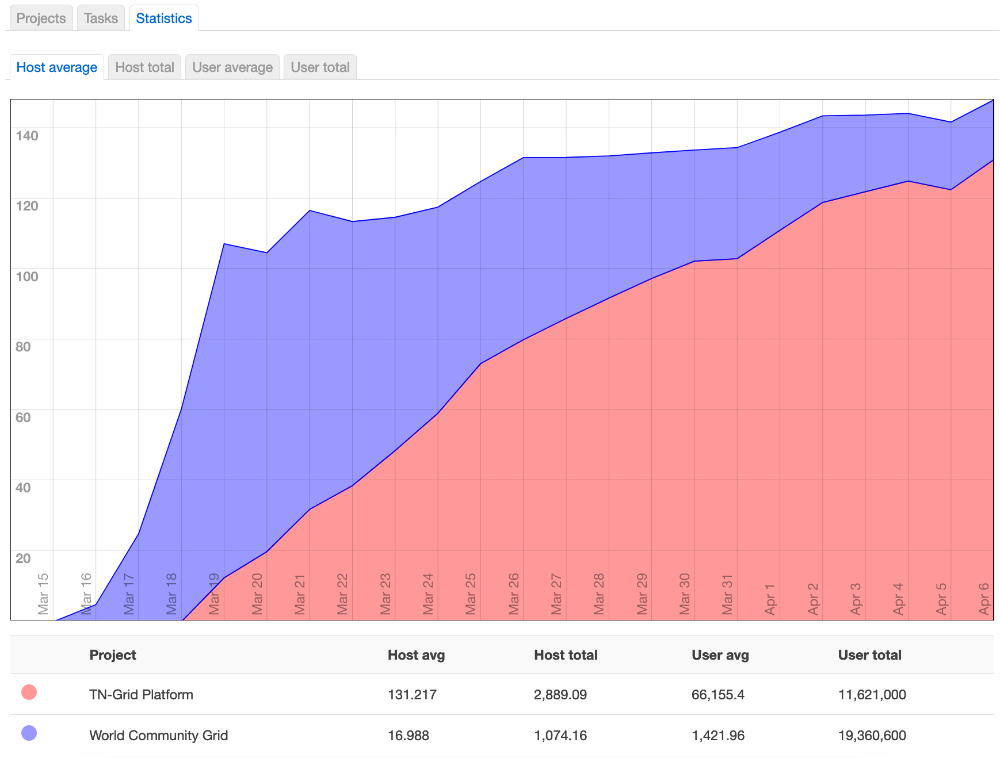

# luci-app-boinc

[BOINC](https://boinc.berkeley.edu) is a platform for volunteer
computing, i.e. an infrastructure to distribute workunits to machines
that are not centrally controlled. OpenWrt provides the package
[boinc](https://github.com/openwrt/packages/tree/master/net/boinc) and,
with it, the command line interface for the configuration. However,
it spares the GUI that novices to BOINC are likely to expect.
There is a curses-application "boinctui" that we we should have a look
at, but that is still on the command line, which should not be required
to install BOINC. The only challenge to run BOINC on modern routers
is disk space. The users hence need to mount an USB stick to /opt/boinc,
which can all be done within LuCI.

This package thus provides a web interface for the control and monitoring
of the BOINC background application. It presents itself as a seamless
extension of the LuCI web interface of OpenWrt. Technically, a small
separate application communicates with the BOINC client and returns
JSON-formatted results to the LuCI interface. The BOINC interface is
part of the "Services" menu and displays the current state of projects
and tasks, but also the development over time:

For novices to BOINC this web interface shall be sufficient to become
productive. The setup can be modified further via the command line. We
have additional ideas that may go beyond what BOINC's RPC offers. For
instance, above images have been created from a setup that originated
on the command line prior to the arrival of the LuCI extension. That
setup also describes the [WorldCommunityGrid](https://www.worldcommunitygrid),
but with the LuCI-prepared setup WCG would not send workunits since
it does not know about the OpenWrt platform, although it is technically
compatible.

The default is to join TN-GRID, which kindly added OpenWrt to its array
supported platform. To participate alo in the World Community Grid, 
and we are aware that Rosetta@Home also works, you
would need to manually change its platform specification. Technically
correct is the default setting that mentions the MUSL C library.
The BOINC projects by default depend on the declaration of a GNU libc
background, which OpenWrt is not compatible with.
WCG or Rosetta@Home run fine since their static binariries do not
any dynamic library. Other projects like Yoyo@Home are not compatible.
If you think you know what are doing, which includes your awareness that you
escape the project statistics for your real platform, then please follow
instructions to adjust your self-declared platform on
https://volunteercomputinghelp.github.io/ .
